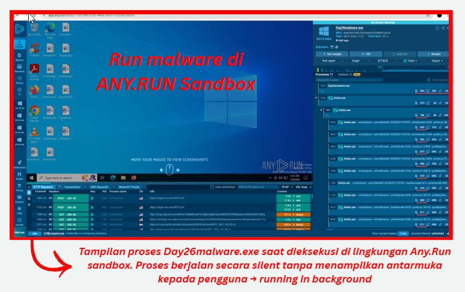

#  Technical Finding 02 – Indikasi Info-Stealer Malware pada Data Browser

---

###  Deskripsi
Berdasarkan hasil analisis malware berbasis sandbox, sampel uji yang dianalisis menunjukkan perilaku yang mengarah pada aktivitas **pengumpulan data browser pengguna secara tidak sah**. Malware dijalankan di lingkungan terisolasi dan tidak menampilkan antarmuka atau notifikasi kepada pengguna.

Perilaku yang teramati menunjukkan fokus pada **akses data sesi dan cookie browser**, yang secara umum dapat dimanfaatkan untuk pengambilalihan sesi autentikasi tanpa memerlukan kredensial pengguna secara langsung.

---

###  Observasi Teknis (Lab Terizin & Disanitasi)
Seluruh observasi dilakukan pada **lingkungan sandbox terisolasi** menggunakan Any.Run dan VirusTotal.

- Malware berjalan secara silent di background tanpa interaksi pengguna
- Tidak ditemukan indikasi error atau crash selama eksekusi
- Proses terdeteksi mengakses direktori profil browser Mozilla Firefox
- Direktori yang diakses: C:\Users\admin\AppData\Roaming\Mozilla\Firefox\Profiles\

- File yang diakses mencakup database cookie dan metadata browsing
- Tidak ditemukan aktivitas destruktif terhadap sistem operasi

Supporting sanitized screenshots tersedia di appendix : 
`

---

###  Dampak Risiko
Jika perilaku serupa terjadi pada endpoint pengguna di lingkungan produksi, potensi dampak meliputi:

- Pencurian cookie dan data sesi autentikasi
- Session hijacking dan pengambilalihan akun aplikasi web
- Kebocoran aktivitas browsing dan informasi personal
- Potensi akses tidak sah lanjutan melalui reuse session

Dampak utama berada pada aspek:
- **Confidentiality**: High  
- **Integrity**: Low  
- **Availability**: None  

---

###  Penilaian Severity (CVSS v3.1 – Estimasi)

| Metric | Value |
|------|------|
| Attack Vector | Local |
| Attack Complexity | Low |
| Privileges Required | None |
| User Interaction | Required |
| Scope | Unchanged |
| Confidentiality Impact | High |
| Integrity Impact | Low |
| Availability Impact | None |

**Estimated CVSS Score:** **7.1 (High)**

Penilaian ini mencerminkan bahwa meskipun eksekusi malware membutuhkan interaksi pengguna, dampak kebocoran data yang dihasilkan tergolong signifikan.

---

###  Rekomendasi Mitigasi
Beberapa langkah mitigasi yang direkomendasikan untuk mengurangi risiko serupa:

- Implementasi **Endpoint Detection & Response (EDR)** atau antivirus berbasis perilaku
- Pembatasan eksekusi file dari direktori user (Downloads, AppData)
- Hardening konfigurasi browser dan sistem operasi
- Penerapan prinsip **least privilege** pada endpoint pengguna
- Peningkatan program **security awareness** terkait social engineering

---

### Catatan Etika
Analisis ini dilakukan **hanya pada sampel uji dan lingkungan sandbox terisolasi**. Tidak ada pengujian terhadap sistem produksi atau data pengguna nyata. Dokumentasi ini disusun untuk tujuan pembelajaran dan peningkatan kesadaran keamanan.
