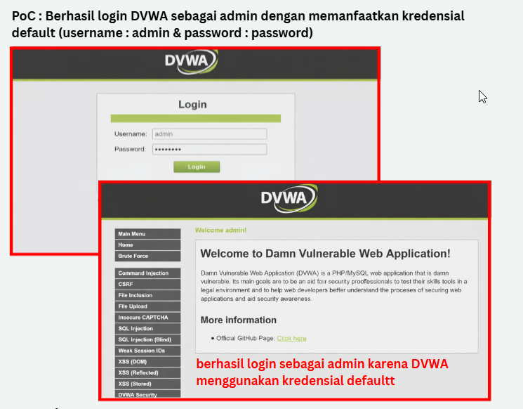

# Finding 01 – Penggunaan Kredensial Default pada Aplikasi Web

## Deskripsi
Saat pengujian login pada aplikasi Damn Vulnerable Web Application (DVWA), sistem masih menggunakan kredensial default (admin/password). Login berhasil dilakukan tanpa konfigurasi tambahan.

## Dampak
- Pengambilalihan akun administrator
- Akses penuh ke seluruh fungsi aplikasi
- Risiko kebocoran, manipulasi, atau penghapusan data

## CVSS v3.1
**Score:** 9.8 (Critical)  
**Vector:** AV:N / AC:L / PR:N / UI:N / S:U / C:H / I:H / A:H

## Proof of Concept (Disanitasi)
- Berhasil login sebagai admin menggunakan kredensial default
- Screenshot disanitasi tersedia di folder appendix

## Mitigasi
- Ganti seluruh kredensial default setelah instalasi
- Terapkan kebijakan password yang kuat
- Implementasikan rate limiting dan account lockout
- Gunakan Multi-Factor Authentication (MFA)
