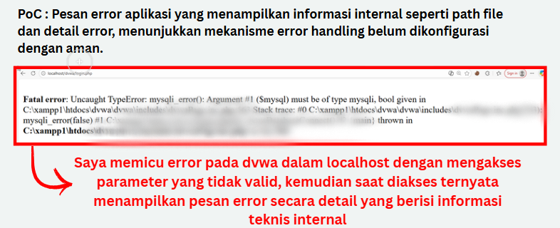

# Finding 04 – Verbose Error Message / Debug Mode Aktif

## Deskripsi
Aplikasi menampilkan pesan error teknis secara detail kepada pengguna umum saat terjadi kesalahan.

## Dampak
- Kebocoran informasi internal (path file, error database)
- Membantu penyerang menyusun serangan lanjutan

## CVSS v3.1
**Score:** 5.3 (Medium)

## Proof of Concept (Disanitasi)
- Error dipicu dengan parameter tidak valid
- Detail error terlihat di browser

## Mitigasi
- Nonaktifkan display error di production
- Simpan error detail di server log
- Gunakan pesan error generik untuk pengguna
